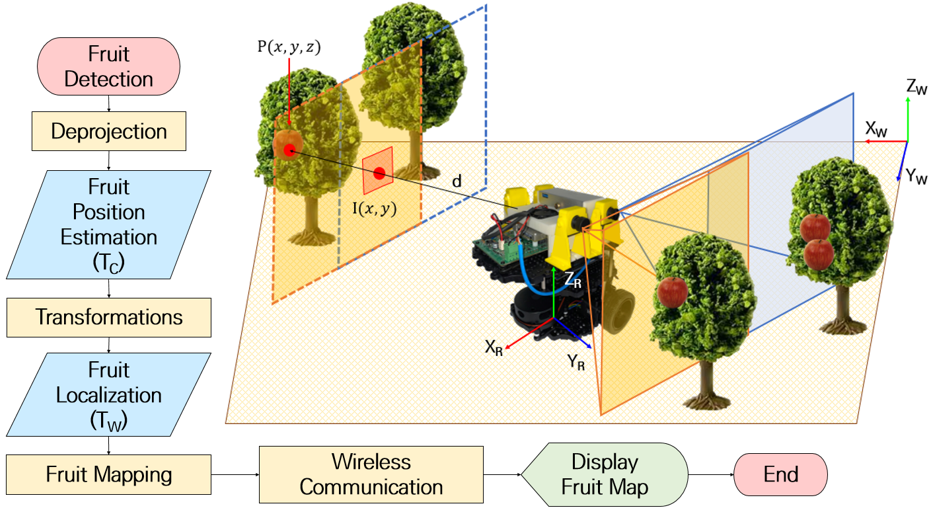
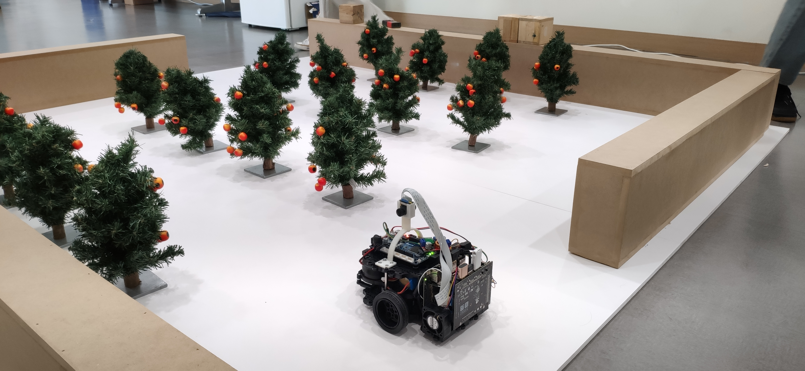

# KSAM-2022-Robotic-Competition

## Introduction
**로봇 미션:** 제작한 로봇을 이용하여 과수원 모사 경기장 내의 출발점부터 도착점까지 주행하면서 과수 모형에 달린 과일을 검출, 분류, 계수함(로봇 임무 제한시간은 5분 이내) <br /> <br />
**주행:** 과수 열을 인식하여 열 사이로 충돌없이 주행해야 함 <br />
      &emsp; - 각 팀별로 주어지는 예비 시험에서 맵작성 가능 <br />
      &emsp; - 주행시간은 로봇의 출발점부터 주행하면서 각 과수의 과일 검출을 끝내고 도착점까지 이동한 시간으로 측정함 <br /> <br />
**회피:** 주행 동안 주어진 장애물 모형을 충돌 없이 회피하여야 함 <br />
      &emsp; - 장애물은 본선대회 당일 임의 재배치 됨 <br /> <br />
**검출:** 과수 모형에 달린 과일을 정상과와 질병과로 분류하고 계수해야 함



## Requirements
```sh
sudo apt-get install ros-noetic-slam-karto
sudo apt-get install ros-noetic-teb-local-planner

# Turtlebot
sudo apt install ros-noetic-turtlebot3-msgs
sudo apt install ros-noetic-turtlebot3
sudo apt install ros-noetic-dynamixel-sdk
```

## Instalation
To install this repository on your home folder:
```sh
cd ~
git clone git@github.com:mefisto2017/KSAM-2022-Robotic-Competition.git
cd KSAM-2022-Robotic-Competition/ros
catkin_make
```
Before running the repository the models path needs to be setup:
```sh
echo 'export GAZEBO_MODEL_PATH=~/KSAM-2022-Robotic-Competition/ros/src/robot_gazebo/models:${GAZEBO_MODEL_PATH}' >> ~/.bashrc
source ~/.bashrc
```

## Run Simulation


### Gazebo
```sh
source ./devel/setup.bash
roslaunch robot_gazebo scenario_1_world.launch
```


### Simultaneous Localization And Mapping
In another terminal:
```sh
cd ~/KSAM-2022-Robotic-Competition/ros
source ./devel/setup.bash
```
Karto SLAM:
```sh
roslaunch robot_slam robot_slam_simulation.launch slam_method:=karto
```
Gmapping SLAM:
```sh
roslaunch robot_slam robot_slam_simulation.launch slam_method:=gmapping
```


### Navigation
In another terminal:
```sh
cd ~/KSAM-2022-Robotic-Competition/ros
source ./devel/setup.bash
```
DWA planner:
```sh
roslaunch turtlebot3_navigation turtlebot3_navigation_simulation.launch planner:=dwa
```
TEB planner:
```sh
roslaunch turtlebot3_navigation turtlebot3_navigation_simulation.launch planner:=teb
```


## Run Real Robot

### Bring Up
```sh
cd ~/KSAM-2022-Robotic-Competition/ros
source ./devel/setup.bash
roslaunch turtlebot_bringup turtlebot_robot
```


### Simultaneous Localization And Mapping
In another terminal:
```sh
cd ~/KSAM-2022-Robotic-Competition/ros
source ./devel/setup.bash
```
Karto SLAM:
```sh
roslaunch robot_slam robot_slam_real.launch slam_method:=karto
```
Gmapping SLAM:
```sh
roslaunch robot_slam robot_slam_real.launch slam_method:=gmapping
```

### Navigation
In another terminal:
```sh
cd ~/KSAM-2022-Robotic-Competition/ros
source ./devel/setup.bash
```
DWA planner:
```sh
roslaunch turtlebot3_navigation turtlebot3_navigation_real.launch planner:=dwa
```
TEB planner:
```sh
roslaunch turtlebot3_navigation turtlebot3_navigation_real.launch planner:=teb
```


## Other Scripts

### Teleoperation
In another terminal:
```sh
cd ~/KSAM-2022-Robotic-Competition/ros
source ./devel/setup.bash
roslaunch turtlebot3_teleop turtlebot3_teleop_key.launch
```

To initiate the waypoints:
```sh
cd ~/KSAM-2022-Robotic-Competition/ros
source ./devel/setup.bash
rosrun turtlebot3_navigation goals.py
```

To reset the robot position in the simulation:

```sh
cd ~/KSAM-2022-Robotic-Competition/ros
source ./devel/setup.bash
rosrun turtlebot3_navigation reset.py
```

Launch obstacle LED and camera servo:

```sh
cd ~/KSAM-2022-Robotic-Competition/ros
source ./devel/setup.bash
rosrun robot_competition leds_servos.py
```

Launch tree identification using lidar:

```sh
cd ~/KSAM-2022-Robotic-Competition/ros
source ./devel/setup.bash
rosrun robot_competition tree_labels.py
```


## YOLOX - Apple Counting
[YOLOX](https://github.com/Megvii-BaseDetection/YOLOX) is a single-stage object detector that makes several modifications to YOLOv3 with a DarkNet53 backbone. We chose YOLOX because it is a lightweight model able to run in a Jetson Nano. Also because our familiarity working with other YOLO neural network.


### Requirements
To install the Yolo requirements:
```sh
cd ./YOLOX
conda create -n yolox python=3.7
conda activate yolox
conda install pytorch==1.8.0 torchvision==0.9.0 torchaudio==0.8.0 cudatoolkit=11.1 -c pytorch -c conda-forge
pip3 install -r requirements.txt
pip3 install -v -e .
```

### Running
Pc Test:
```sh
python3 tools/demo.py video -f ./nano.py -c ./best_ckpt.pth --path ./1_2.mp4 --conf 0.25 --nms 0.45 --tsize 320 --save_result --device [cpu/gpu]
```

For counting the apples:
```sh
python3 digiag_1st.py capture -f ./nano.py -c ./best_ckpt.pth --conf 0.25 --nms 0.45 --tsize 320 --device gpu --save_result
```
Then to save the results to the USB:
```sh
sudo fdisk -l
sudo mount ~/media/myusb2
```
Sometimes there are some errors with the camera drivers, if that is the case this is the workaround:
```sh
rm ~/.cache/gstreamer-1.0/registry.aarch64.bin
export LD_PRELOAD=/usr/lib/aarch64-linux-gnu/libgomp.so.1
sudo service nvargus-daemon restart
```

### Training
To train the model, please refer to the guidelines provided by [YOLOX](https://github.com/Megvii-BaseDetection/YOLOX/blob/main/docs/train_custom_data.md).


